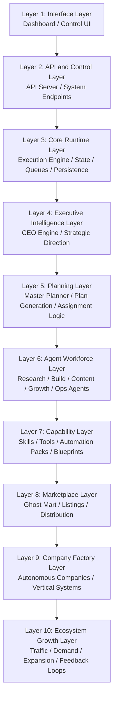
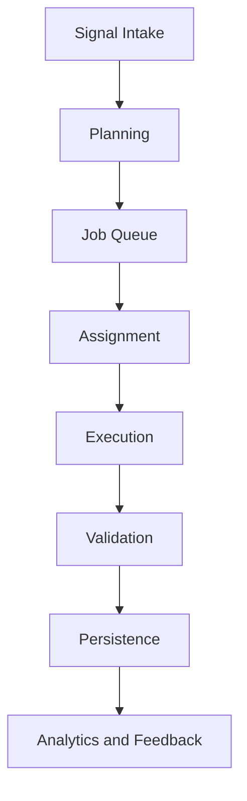

# GhostClaw System Layers

## Purpose

This document provides the **single-screen visual model** of the GhostClaw operating system.

It exists to make the GhostClaw architecture instantly understandable to:

- developers
- contributors
- investors
- AI agents
- future platform builders

This is the **visual entry point** for the GhostClaw system.

For full details, see:

- `ghostclaw_system_map.md`
- `ghostclaw_master_control_system.md`
- `ghostclaw_runtime_execution_spec.md`

---

## Core System Idea

GhostClaw is an **Autonomous AI Operating System** composed of three major platform capabilities:

1. **AI Agent Runtime**
2. **Capability Marketplace (Ghost Mart)**
3. **Autonomous Company Factory**

These capabilities operate through a shared control chain:

Dashboard
↓
API Server
↓
Core Runtime
↓
CEO Engine
↓
Planner
↓
Agents
↓
Skills
↓
Marketplace

---

## GhostClaw System Layers Diagram

---

## Layer Definitions

### Layer 1: Interface Layer

The visible control surface of GhostClaw.

Examples:

- dashboard
- monitoring panels
- admin controls
- artifact views
- company status views

Purpose:

- give humans visibility into the system
- display health, outputs, and execution state
- provide a control point for operations

### Layer 2: API and Control Layer

The system access and coordination boundary.

Examples:

- runtime API
- agent registry endpoints
- marketplace endpoints
- execution state endpoints
- analytics endpoints

Purpose:

- expose GhostClaw functionality programmatically
- connect apps, agents, and services to the runtime
- standardize control-plane access

### Layer 3: Core Runtime Layer

The execution heart of GhostClaw.

Responsibilities include:

- signal intake
- job creation
- queue management
- state transitions
- retries
- persistence
- observability
- artifact storage

This is the system substrate that turns architecture into actual execution.

### Layer 4: Executive Intelligence Layer

The strategic direction layer.

Examples:

- Platform CEO Agent
- Marketplace CEO Agent
- SEO CEO Agent
- Company CEO Agent

Purpose:

- define strategic priorities
- set platform direction
- choose major goals
- handle escalations and high-level decisions

### Layer 5: Planning Layer

The planning and decomposition layer.

Examples:

- Master Planner Agent
- plan generation
- task decomposition
- assignment logic
- workflow orchestration

Purpose:

- convert signals into plans
- map goals into jobs
- define required agents, skills, and outputs

### Layer 6: Agent Workforce Layer

The active workforce of the GhostClaw ecosystem.

Examples:

- Research Agents
- Keyword Agents
- Content Agents
- Website Builder Agents
- Marketplace Agents
- Analytics Agents
- Runtime Monitor Agents
- Quality Assurance Agents

Purpose:

- perform the actual work of the system
- execute plans
- generate outputs
- operate companies and platform workflows

### Layer 7: Capability Layer

The reusable capability layer used by agents.

Examples:

- skills
- tools
- automation packs
- blueprints
- integrations

Purpose:

- make GhostClaw modular
- allow agents to invoke reusable abilities
- provide installable, composable building blocks

### Layer 8: Marketplace Layer

The Ghost Mart distribution layer.

Ghost Mart distributes:

- agents
- skills
- automation packs
- tools
- company blueprints
- developer tools
- integrations

Purpose:

- package capabilities
- publish capabilities
- distribute capabilities across the ecosystem

### Layer 9: Company Factory Layer

The company creation layer.

Examples:

- AI SEO agency
- service businesses
- niche automation platforms
- autonomous digital companies

Purpose:

- assemble agents, skills, and workflows into businesses
- launch repeatable company blueprints
- turn GhostClaw into a company-building engine

### Layer 10: Ecosystem Growth Layer

The expansion layer of the platform.

Examples:

- SEO growth loops
- demand detection
- marketplace expansion
- new vertical discovery
- partner and developer ecosystem growth

Purpose:

- feed new opportunities into the system
- generate traffic and adoption
- expand GhostClaw over time

---

## Runtime Sub-Layers

Inside the Core Runtime Layer, GhostClaw executes work through these internal sub-layers:

This runtime structure transforms:

signal
→ plan
→ job
→ execution
→ output
→ new signal

---

## Why This File Matters

This document gives GhostClaw a **canonical visual architecture**.

It helps readers understand that GhostClaw is not just:

- a dashboard
- a set of agents
- a marketplace
- a company blueprint system

It is a **layered operating system** where each part of the ecosystem has a clear role.

This makes the project easier to:

- explain
- build
- extend
- document
- onboard contributors into
- align across AI agents and humans

---

## Recommended Reading Order

For new readers, use this sequence:

1. `README.md`
2. `ghostclaw_system_layers.md`
3. `ghostclaw_system_map.md`
4. `ghostclaw_master_control_system.md`
5. `ghostclaw_runtime_execution_spec.md`

---

## Summary

GhostClaw is a layered AI operating system.

Its architecture progresses from:

**interface** → **control** → **runtime** → **strategy** → **planning** → **agents** → **capabilities** → **marketplace** → **companies** → **ecosystem growth**

This layered model is a clear way to understand how GhostClaw operates as a self-expanding autonomous platform.
